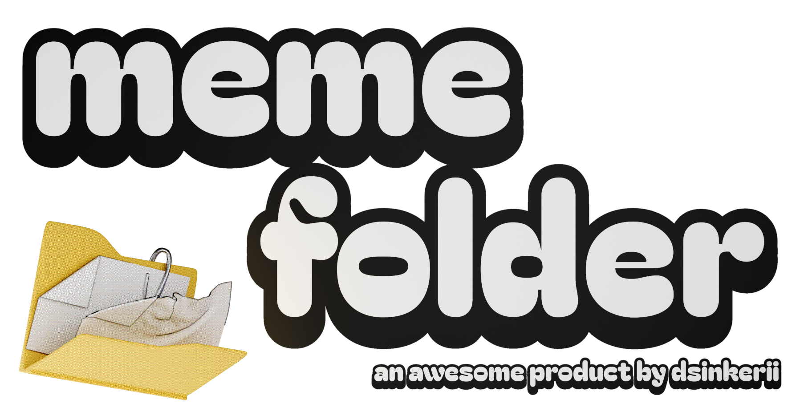

# memefolder



lets you find that *one* specific meme by the context/tags of it.

# HOW 2 INSTALL
- goto [latest release here](https://github.com/dsinkerii/memefolder/releases/latest)
- install
- finish the tutorial
- you're done!

# WHAT DOES IT HAVE? WHAT IS IT?
ever found yourself in that one position of not knowing where your meme is, somewhere nested deeeeep inside your memes folder? **memefolder** is here to help! using the awesome technology of semantic search, you can search for your memes using context, as well as narrow down the search using cool tags!


# WHAT TAGS ARE AVAILABLE:

### file type filters
| tag | filters |
|-----|---------|
| `@image` / `@picture` / `@photo` | media_type = image |
| `@video` | media_type = video |
| `@audio` / `@sound` | media_type = audio |
| `@text` | media_type = text |
| `@gif` | ext = gif |

### file extension filters
`@.mp4` `@.jpg` `@.jpeg` `@.png` `@.gif` `@.webm` `@.webp` `@.svg` `@.mp3` `@.wav` `@.ogg` `@.flac` `@.mkv` `@.avi` `@.mov`

any 2-4 letter extension works

### score filter (post-filters semantic results)
`@score>50` `@score<50` `@score=50` `@score>=50` `@score<=50`

filters by similarity score (0-100). only works when semantic search text is present

### boolean operators
`&` = AND, `|` = OR, `!` = NOT, `(` `)` = grouping

(more in [wiki](https://github.com/dsinkerii/memefolder/wiki/tags))

### example
```
program fl studio @image @score>50
``` 

semantic search for "program fl studio", filter images only, min score 50.
